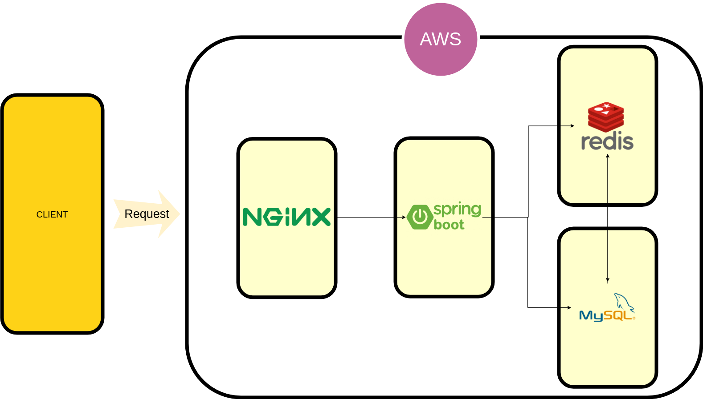

# BLIND MARKET BACKEND

## PURPOSE


## STACK
JAVA spring boot, spring-security, spring-data-jpa, MySQL, REDIS

## ARCHITECT


## API REFERENCE

### Request

__API 호출방식__
| 메서드 | 구분 | 파라미터 전달 |
| --- | --- | --- |
| GET | URL | 요청 URL에 표기된 쿼리 파라미터 |
| POST | Body | Request Body에 application/json으로 표현된 데이터 |

### Response

##### 응답 상태 코드
| 상태 코드 | 설명 |
| --- | --- |
| 200 | API 실행 성공 |
| 400 | 4xx 오류 |
| 500 | 5xx 오류 |

##### 공통 Response Body
| 필드 | 타입 | 필수 여부 | 설명 |
| --- | --- | --- | --- |
| _code | Number | True | [HTTP 응답코드 3자리](#응답-상태-코드)|
| _message | String | True | 결과 메시지 |

##### API URL 구조
```
/api/{domain}/v{version}/{API name}
```

### Domains

#### Join
| Version | API name | 설명 |
| --- | --- | --- |
| 1 | user | Blind Market에 유저 정보를 등록 |

##### user
__코드 예제__
```
```
| 메서드 | 요청 URL |
| --- | --- |
| POST | /api/join/v1/user |

__Request Header__
| 파라미터 | 타입 | 필수 여부 | 설명 |
| --- | --- | --- | --- |
| walletId | String | True | 지갑주소 |
| nickName | String | False | 사용자의 닉네임, null일 경우 고유 uuid 제공 |
-------------------------------

#### Auth(Authorization) // 이 부분은 민규님 도움 얻어서 진행
| Version | API name | 설명 |
| --- | --- | --- |
| 1 | login | 사용자 로그인 |
| 1 | logout | 사용자 로그아웃 |

##### Login
__코드 예제__
```
```
| 메서드 | 요청 URL |
| --- | --- |
| POST | /api/auth/v1/login |

__Request Header__
| 파라미터 | 타입 | 필수 여부 | 설명 |
| --- | --- | --- | --- |
|  |  |  |  |

##### Logout // logout 기능 구현시 api 호출이 필요한가?
__코드 예제__
```

```
| 메서드 | 요청 URL |
| --- | --- |
| GET | /api/auth/v1/logout |

__Request Header__
| 파라미터 | 타입 | 필수 여부 | 설명 |
| --- | --- | --- | --- |
|  |  |  |  |
------------------------------

#### Sale
| Version | API name | 설명 |
| --- | --- | --- |
| 1 | list | 등록된 모든 판매글을 조회 |
| 1 | item | 특정 판매글을 등록, 조회, 수정, 삭제 |

##### list
__코드 예제__
```
```
| 메서드 | 요청 URL |
| --- | --- |
| GET | /api/sale/v1/list |

__Request Header__
| 파라미터 | 타입 | 필수 여부 | 설명 |
| --- | --- | --- | --- |
| title | String | False | 제목에 해당 키워드가 포함된 게시글을 조회 |
| write | String | False | 작성자 nickname에 해당 키워드가 포함된 게시글을 조회 |
| content | String | False | 글 내용에 해당 키워드가 포함된 게시글을 조회 |
| from | 


------------------------------

#### User Info
| Version | API name | 설명 |
| --- | --- | --- |
| 1 | user | Blind Market에 유저 정보를 등록 |

| 파라미터 | 타입 | 필수 여부 | 설명 |
| --- | --- | --- | --- |
|  |  |  |  |

#####
| 메서드 | 요청 URL |
| --- | --- |
| POST | /api/join/v1/user |